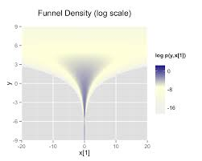

```{r setup, include=FALSE}
options(htmltools.dir.version = FALSE)

knitr::opts_chunk$set(warning = FALSE, message = FALSE, fig.width = 10, fig.height = 6, dpi = 300)
```

# What is Stan?

Stan is a probabilistic programming language for Bayesian statistical inference written in C++.

--

Wrappers for other languages:

* PyStan - Python
* RStan - R
* CmdStan - command line

---

# Refresher: Bayesian inference

* Vector of parameters $\theta$ and data $y$.
--

* Goal: Develop a model $p(y, \theta)$ to arrive at $p(\theta|y)$.
--

* Tool: Bayes' rule
$$p(\theta|y) = \frac{p(y, \theta)}{p(y)} = \frac{p(y|\theta)p(\theta)}{p(y)} \propto p(y|\theta)p(\theta)$$
--

* $p(\theta|y)$ is what we learn from the data, aka the posterior distribution.
--

* $p(y|\theta)$ is the likelihood function. This is the model.
--

* $p(\theta)$ is our prior distribution. It's what believe about the parameters before we look at the data.

---

# Sometimes it's easy

Binomial model
--

* $\theta$ is the unknown probability of a binary event.
--

* $y_i \in \{0, 1\}$ for $i \in \{1, 2, \ldots n\}$
--

* $y = \sum_{i=1}^n y_i$
--

* Likelihood - two different ways ways (Bernoulli or binomial)

$$ p(y_i|\theta) = \theta$$
$$ p(y|\theta) = {n \choose y} \theta^y (1 - \theta)^{n - y}$$
--

* Prior - beta distribution - $Beta(\alpha, \beta)$

$$ p(\theta) = \frac{\Gamma(\alpha + \beta)}{\Gamma(\alpha)\Gamma(\beta)} \theta^{\alpha - 1}(1 - \theta)^{\beta - 1}$$
--

* Posterior - updated beta - $Beta(y + \alpha, n - y + \beta)$
$$ p(\theta|y) \propto \theta^{y + \alpha - 1}(1 - \theta)^{n - y + \beta - 1}$$

---

# Bayesian statistics vs. frequentist statistics vs. machine learning

Frequentist inference
--

* 95% confidence interval - There is a 95% confidence interval that the calculated confidence interval from an experiment contains $\theta$, the population parameter.
--

* How do we interpret that?
--

* Tools: Fisher exact test, two sided t-test, ANOVA, MANOVA, etc.

--

Machine learning (in this case predictive analytics)
--

* Great for conditional expectations, aka predictions ... what is the probability this locomotive with these signals will break down in the next two weeks?
--

* Not intended for inference ... what was the effect of this class on SAT scores and can we quantify our uncertainty? How much faster is the North Platte shop than the Omaha shop at repairing locomotives while adjusting for the types of locomotives each shop receives?

---

# More complex models don't have elegant solutions
--

* Examples where the prior and posterior come from the same family of distributions are called conjugate priors.
--

* Very easy to update posterior with data
--

* When $\theta$ is high dimensional this isn't possible or the prior and posterior aren't conjugate this isn't possible

---

# Bayesian algorithms
--

Algorithms sample from the posterior distribution.
--

* Metropolis-Hastings

--

Sample a point $x'$ from a normal distribution centered around the current point, $x$. $\sigma$ in the normal distrubtion is the "step size".

--

Accept the point with a given probability:

$$A(x', x) = min\left(1, \frac{P(x')}{P(x)}\right)$$
--

Samples form a Markov Chain with steady state distribution equal to $P$.

--
Suffers from curse of dimensionality. As the number of dimensions grows, a step size of $\sigma$ covers an exponentionally smaller proportion of the parameter space.

--

* Hamiltonian Monte Carlo

--

* No U-Turn Sampler

--

* Automatic Differentiation Variational Inference

---

# On to Stan

Stan is a language for writing down the data, priors, and likelihood function.

```{stan, eval=FALSE, output.var='test'}
data { 
    int<lower=0> N; 
    int<lower=0, upper=1> y[N];
    real<lower=0> alpha;
    real<lower=0> beta;
} 
parameters {
    real<lower=0, upper=1> theta;
} 
model {
    theta ~ beta(alpha, beta);
    y ~ bernoulli(theta);
}

```

---

# Six blocks of Stan

```
data

transformed data

parameters

transformed parameters

model

generated quantities
```

---

# `data`

The "data" block reads external information

```{stan eval=FALSE, output.var='test'}
data { 
    int<lower=0> N; 
    int<lower=0, upper=1> y[N];
    real<lower=0> alpha;
    real<lower=0> beta;
}
```

---

# `data`

The "transformed data" block allows for preprocessing of the data

```{stan, eval=FALSE, output.var='test'}
transformed data {
    int<lower=0> sum_y = sum(y);
}
```

---

# `parameters`

The "parameters" block defines the sampling space

```{stan, eval=FALSE, output.var='test'}
parameters { 
    real<lower=0, upper=1> theta;
}
```

---

# `transformed parameters`

The "transformed parameters" block allows for parameter processing before the posterior is computed.

--

Useful when you have parameters which are better for sampling but you want to infer other parameters.

--

$\phi$ represents the mean and $\lambda$ represents the "total count".

```{stan, eval=FALSE, output.var='test'}
parameters {
    real<lower=0, upper=1> phi;
    real<lower=0.1> lambda;
    ...
transformed parameters {
    real<lower=0> alpha;
    real<lower=0> beta;
    ...
    alpha = lambda * phi;
    beta = lambda * (1 - phi);
    ...
```

---

# `model`

In the model, we define the priors and likehood function

```{stan, eval=FALSE, output.var='test'}
model {
    theta ~ beta(alpha, beta);
    y ~ bernoulli(theta);
}
```

--

or

```{stan, eval=FALSE, output.var='test'}
model {
    theta ~ beta(alpha, beta);
    sum(y) ~ binomial(N, theta);
}
```

--

or 

```{stan, eval=FALSE, output.var='test'}
model {
    theta ~ beta(alpha + sum_y, beta + N - sum_y);
}
```

---

# `generated quantities`

The "generated quantities" block allows for postprocessing

```{stan, eval=FALSE, output.var='test'}
generated quantities {
    int<lower=0, upper=N> sum_y_hat;
    sum_y_hat = binomial_rng(N, theta);
}
```

---

# Properties of Stan
--

* Statically typed
--

* Can have lower and upper bounds
--

* Other objects built on top

```{stan, eval=FALSE, output.var='test'}
vector[10] a;
matrix[10, 1] b;
row_vector[10] c;
vector[10] b[10];

simplex[5] theta;
ordered[5] o;
...
```
---

# Properties of Stan

* Has control flow and iteration

```{stan, eval=FALSE, output.var='test'}
if/then/else
for (i in 1:I)
while (i < I)
```

--

* Vectorized statements

```{stan, eval=FALSE, output.var='test'}
model {
    theta ~ beta(alpha, beta);
    y ~ bernoulli(theta);
}
```

---

# Running Stan from R

```{stan eval=TRUE, output.var="ex1"}
data {
    int<lower=0> N;
    int<lower=0, upper=1> y[N];
    real<lower=0> alpha;
    real<lower=0> beta;
}
parameters {
    real<lower=0,upper=1> theta;
}
model {
    theta ~ beta(alpha, beta);
    sum(y) ~ binomial(N, theta);
}
generated quantities {
    int<lower=0, upper=N> sum_y_hat;
    real<lower=0, upper=N> sum_y_hat_real;
    real<lower=0, upper=1> pct_success;
    sum_y_hat = binomial_rng(N, theta);
    sum_y_hat_real = sum_y_hat;
    pct_success = sum_y_hat_real / N;
}
```

---

# Running Stan from R

```{r eval=TRUE, results='hide', warning=FALSE, message=FALSE}
library(rstan)

s <- 20
N <- 60
y <- c(rep(1, s), rep(0, N - s))

dat <- list(N = N, y = y, alpha = 1, beta = 1)

fit <- sampling(
    object = ex1
    , data = dat
    , iter = 1000
    , chains = 4
)
```

---

# Running Stan from R

```{r eval=TRUE}
print(fit, digits = 3, pars = c('theta', 'sum_y_hat', 'pct_success'), probs = c(0.1, 0.5, 0.9))
```

---

# Diagnostics in R

```{r eval=TRUE}
traceplot(fit, pars = "theta", inc_warmup = TRUE)
```

---

# Hierarchical models in Stan

--

Who's the best batter in baseball?

```{r echo=FALSE}
library(dplyr)
library(tidyr)
library(Lahman)
library(rstan)

career <- Batting %>%
    filter(AB > 0) %>%
    anti_join(Pitching, by = "playerID") %>%
    group_by(playerID) %>%
    summarize(H = sum(H), AB = sum(AB)) %>%
    mutate(average = H / AB)

career <- Master %>%
    tbl_df() %>%
    select(playerID, nameFirst, nameLast) %>%
    unite(name, nameFirst, nameLast, sep = " ") %>%
    inner_join(career, by = "playerID") %>%
    select(-playerID)

N <- nrow(career)
# N <- 100

career_sample <- sample_n(career, size = N)

baseball_dat <- list(
    N = N
    , H = career_sample$H
    , AB = career_sample$AB
)
```

```{r}
arrange(career, desc(average), desc(AB))
```

--

That can't be right

---

# Let's model this

$$\theta_i \sim Beta(1, 1)$$

$$H_i \sim Binom(AB_i, \theta_i)$$

```{stan eval=TRUE, output.var="nopool"}
data {
    int<lower=0> N; // Num. of observations
    int<lower=0> H[N]; // Hits
    int<lower=0> AB[N]; // At bats
}
parameters {
    vector<lower=0, upper=1>[N] theta; // chance of success
}
model {
    theta ~ beta(1, 1);
    H ~ binomial(AB, theta);
}
```

---

# The Result

John Paciorek is still the best batter in baseball with 3 hits in 3 at-bats.

```{r eval=TRUE, echo=FALSE}
fit_nopool <- sampling(
    object = nopool
    , data = baseball_dat
    , iter = 1000
    , chains = 4
)

predicted_ba <- fit_nopool %>%
    as.matrix() %>%
    `[`(, -(N + 1)) %>%
    apply(MARGIN = 2, FUN = median) %>%
    unname()

phi <- mean(as.matrix(fit_nopool)[, 1])

library(gguptake)

uptake_red <- get_colors('clementine-orange')

career_sample %>% 
    mutate(predicted_ba = predicted_ba) %>%
    ggplot(aes(x = average, y = predicted_ba, color = AB)) +
    geom_point(alpha = 0.2) +
    theme_uptake(font = 'Roboto') +
    geom_abline(color = uptake_red, linetype = 'dashed') +
    geom_hline(yintercept = phi, color = uptake_red, linetype = 'dashed') +
    scale_color_gradientn(colours = get_palette('sequential'), trans = 'log10') +
    labs(
        x = 'Original Batting Average'
        , y = 'Estimated Theta'
        , title = 'Estimated Batting Averages'
        , color = 'At Bats'
    )
```

---

# The Other Extreme

What if we pool all the players together

$$\theta \sim Beta(1, 1)$$

$$H_i \sim Binom(AB_i, \theta)$$

```{stan eval=TRUE, output.var="pool"}
data {
    int<lower=0> N; // Num. of observations
    int<lower=0> H[N]; // Hits
    int<lower=0> AB[N]; // At bats
}
parameters {
    real<lower=0, upper=1> theta; // chance of success
}
model {
    theta ~ beta(1, 1);
    H ~ binomial(AB, theta);
}
```

---

# The Other Extreme

```{r eval=TRUE, echo=FALSE}
fit_pool <- sampling(
    object = pool
    , data = baseball_dat
    , iter = 1000
    , chains = 4
)

print(fit_pool, probs = c(0.025, 0.5, 0.975), digits = 3)
```

---

# Is there a middle ground?

We know the overall batting average is around 27%. If a player has very few at-bats, we should adjust their batting average to much closer to 27%. We want a model which learns the overall percent and adjust based on the player's number of at-bats.

--

So, we instead of having a $Beta(1, 1)$ prior for $\theta_i$ we want to learn a better parameters than (1,1).

--

$$ \kappa \sim pareto(1, 0.5)$$
$$ \phi \sim U(0, 1)$$
$$ \theta_i \sim Beta(\phi \cdot \kappa, (1 - \phi) \cdot \kappa)$$

$$ H_i \sim Binom(AB_i, \theta_i) $$

---

# The Stan Model

```{stan eval=TRUE, output.var="partial"}
data {
    int<lower=0> N; // Num. of observations
    int<lower=0> H[N]; // Hits
    int<lower=0> AB[N]; // At bats
}
parameters {
    real<lower=0, upper=1> phi;         // population chance of success
    real<lower=1> kappa;                // population concentration
    vector<lower=0, upper=1>[N] theta;  // chance of success 
}
model {
    kappa ~ pareto(1, 0.5);                        // hyperprior
    theta ~ beta(phi * kappa, (1 - phi) * kappa);  // prior
    H ~ binomial(AB, theta);                        // likelihood
}
```

---

# Results

```{r eval=TRUE, echo=FALSE}
fit_partial <- sampling(
    object = partial
    , data = baseball_dat
    , iter = 1000
    , chains = 4
)

predicted_ba <- fit_partial %>%
    as.matrix() %>%
    `[`(, -c(1, 2, N + 3)) %>%
    apply(MARGIN = 2, FUN = median) %>%
    unname()

phi <- mean(as.matrix(fit_partial)[, 1])
kappa <- mean(as.matrix(fit_partial)[, 2])

library(gguptake)

uptake_red <- get_colors('clementine-orange')

career_sample %>% 
    mutate(predicted_ba = predicted_ba) %>%
    ggplot(aes(x = average, y = predicted_ba, color = AB)) +
    geom_point(alpha = 0.2) +
    theme_uptake(font = 'Roboto') +
    geom_abline(color = uptake_red, linetype = 'dashed') +
    geom_hline(yintercept = phi, color = uptake_red, linetype = 'dashed') +
    scale_color_gradientn(colours = get_palette('sequential'), trans = 'log10') +
    labs(
        x = 'Original Batting Average'
        , y = 'Estimated Theta'
        , title = 'Bayesian Adjustment of Batting Average'
        , color = 'At Bats'
    )

```

---

# Results

```{r eval=TRUE, echo=FALSE}
career_adjusted <- career %>%
    mutate(adj_average = (H + phi*kappa)/(AB + kappa))
```

```{r eval=TRUE}
career_adjusted %>%
    arrange(desc(adj_average))
```

---

# Packages which use Stan

--

* `shinystan` - great for diagnosing and visualizing your model

--

* `rstanarm` - emulates other R models like `lm`, `glm`, and `lmer` but running a compiled Stan model.

--

* `brms` - multilevel models in R

--

* `prophet` - time series forecasting

---

# Stan is a leaky abstraction

--

The idea behind Stan is you write your model in a portable language. You don't need to write code to fit the model. All you need is data, priors, and likelihoods.

--

However, these sampling algorithms can have a lot of trouble sampling certain parameter spaces and the model may take a really long time or never converge.

--

Learning certain best practices can help models fit a lot faster.

---

# Avoid highly correlated parameters

```{stan, eval=FALSE, output.var='test'}
parameters {
    real y;
    vector[9] x;
}
model {
    y ~ normal(0, 3);
    x ~ normal(0, exp(y/2));
}
```



---

# Avoid highly correlated parameters

```{stan, eval=FALSE, output.var='test'}
parameters {
    real y_raw;
    vector[9] x_raw;
}
transformed parameters {
    real y;
    vector[9] x;
    y = 3.0 * y_raw;
    x = exp(y/2) * x_raw;
}
model {
    y_raw ~ normal(0, 1); // implies y ~ normal(0, 3)
    x_raw ~ normal(0, 1); // implies x ~ normal(0, exp(y/2))
}
```

--

A related example is using non-centered parameterizations.

---

# Take advantage of conjugate priors

See the beta and binomial examples above

--

# Take advantage of sufficient statistics

See the same beta and binomial example

--

# Vectorize

---

# The folk theorem of statistical computing

> When you have computational problems, often there’s a problem with your model
> - Andrew Gelman

